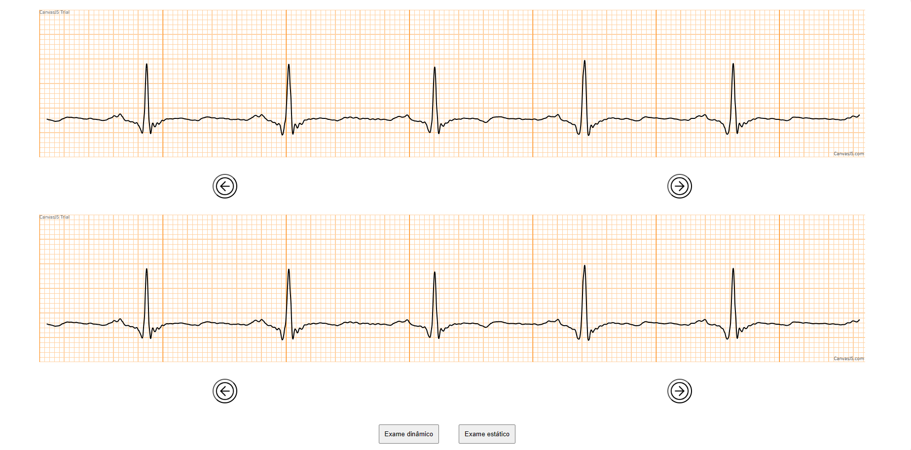
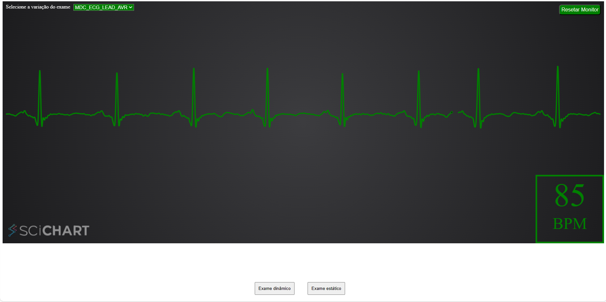
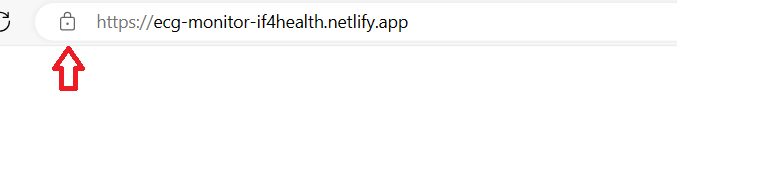
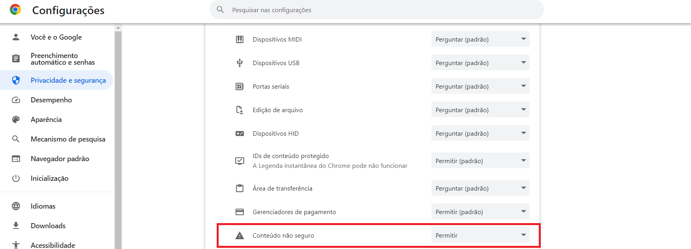
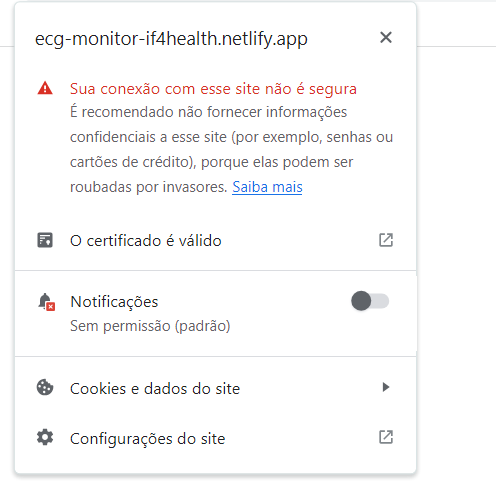

# Ecg Monitor
O Ecg Monitor é uma aplicação front-end desenvolvida com ReactJS, para visualizar exames ECG (Eletrocardiograma) que busca os dados dos exames do projeto FASS-ECG https://github.com/if4health/FASS-ECG no padrão FHIR https://www.hl7.org/fhir/. A aplicação é capaz de exibir os exames tanto na forma dinamica, quanto na forma estatica.

### Exemplo estático

### Exemplo dinamico

## Requisitos
NodeJS [https://nodejs.org/en/](URL) 

## Instalação
Primeiramente, antes da instalação é necessário clonar o projeto, para isso no terminal que você utiliza usar o comando:

`git clone https://github.com/if4health/ecgmonitor`

Após o clone entre no projeto e novamente abra o terminal e execute o comando abaixo (pode levar alguns minutos):

`npm install`

Após instalar o projeto basta executar o comando abaixo:

`npm start`

Pronto o projeto ja vai carregar na url http://localhost:8080

## Observações

### Ambiente

O projeto ja esta pronto para subir para um ambiente do Netlify, atualmente esta na URL https://ecg-monitor-if4health.netlify.app/

### Pendência
Atualmente no arquivo services, tem um alguns dados mocados pois ainda não esta completamente pronta a solução que ira exibir os BPMs no projeto IFCloud https://github.com/if4health/ifcloud

### Ajustes necessários
Também é importante destacar que atualmente como o projeto do FASS-ECG esta em ambiente apenas http, os navegadores bloqueiam a chamada do API no ambiente do Netlify e com isso não é possível visualizar o exame, por isso siga o roteiro abaixo para poder visuzalizar no Google chrome:

Para abrir o exame ECG, entra no link React App (ecg-monitor-if4health.netlify.app), no google chrome ao entra na tela estara branca, então clique no cadeado conforme imagem abaixo:

 

Após a o clique,  clicar em “Configurações do site”:

 
Irá abrir uma lista de Permissões, na lista procure o item “Conteúdo não seguro” e coloque a opção “permitir” Conforme abaixo:

 

Após isso somente entrar no site novamente e atualizar a pagina

